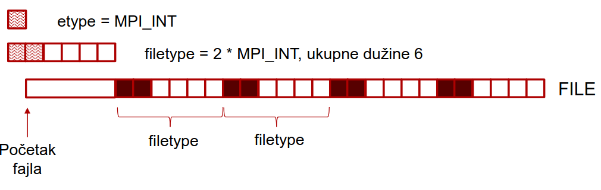

# MPI I/O

## Sta je bitno da se zna

- rad sa binarnim fajlovima, koriscenjem neformatiranog I/O;
- potpisi funkcija i primeri:
  - [`int MPI_File_open(MPI_Comm comm, ROMIO_CONST char *filename, int amode, MPI_Info info, MPI_File *fh)`](https://www.mpich.org/static/docs/v3.3/www3/MPI_File_open.html);
    - primer poziva - `MPI_File_open(MPI_COMM_WORLD, "file.out", MPI_MODE_CREATE | MPI_MODE_WRONLY, MPI_INFO_NULL, MPI_STATUS_IGNORE)`;
    - modovi -  `MPI_MODE_WRONLY`, `MPI_MODE_CREATE`, `MPI_MODE_RDONLY`;
    - status i info mogu da se izbegnu sa - `MPI_STATUS_IGNORE` i `MPI_INFO_NULL`;
  - [`int MPI_File_seek(MPI_File fh, MPI_Offset offset, int whence)`](https://www.mpich.org/static/docs/latest/www3/MPI_File_seek.html);
    - primer poziva - `MPI_File_seek(fh, bufsize * world_rank, MPI_SEEK_SET)`;
    - whence - `MPI_SEEK_SET`, `MPI_SEEK_CUR`, `MPI_SEEK_END`;
  - [`int MPI_File_read(MPI_File fh, void *buf, int count, MPI_Datatype datatype, MPI_Status *status)`](https://www.mpich.org/static/docs/v3.1/www3/MPI_File_read.html);
    - primer poziva - `MPI_File_read(fh, buf, bufsize / sizeof(int), MPI_INT, MPI_STATUS_IGNORE)`;
  - [`int MPI_File_write(MPI_File fh, ROMIO_CONST void *buf, int count, MPI_Datatype datatype, MPI_Status *status)`](https://www.mpich.org/static/docs/v3.2/www3/MPI_File_write.html);
    - primer poziva - `MPI_File_write(fh, buf, bufsize / sizeof(int), MPI_INT, MPI_STATUS_IGNORE)`;
  - [`int MPI_File_close(MPI_File *fh)`](https://www.mpich.org/static/docs/v3.0.x/www3/MPI_File_close.html);
    - primer poziva - `MPI_File_close(&fh)`;
  - [`int MPI_File_read_at(MPI_File fh, MPI_Offset offset, void *buf, int count, MPI_Datatype datatype, MPI_Status *status)`](https://www.mpich.org/static/docs/v3.0.x/www3/MPI_File_read_at.html);
    - kao spoj `MPI_File_seek` i `MPI_File_read`;
  - [`int MPI_File_write_at(MPI_File fh, MPI_Offset offset, ROMIO_CONST void *buf, int count, MPI_Datatype datatype, MPI_Status * status)`](https://www.mpich.org/static/docs/latest/www3/MPI_File_write_at.html);
    - kao spoj `MPI_File_seek` i `MPI_File_write`;
  - [`int MPI_File_set_view(MPI_File fh, MPI_Offset disp, MPI_Datatype etype, MPI_Datatype filetype, ROMIO_CONST char *datarep, MPI_Info info)`](https://www.mpich.org/static/docs/latest/www3/MPI_File_set_view.html);
    - primer sa slajdova:
      - prvo resenje:
        - `MPI_Type_contiguous(2, MPI_INT, &contig);`
        - `MPI_Type_create_resized(contig, 0, 6 * sizeof(int), &filetype);`
        - `MPI_Type_commit(&filetype);`
        - `MPI_File_set_view(fh, 5 * sizeof(int), etype, filetype, "native",`
        - `MPI_INFO_NULL);`
      - drugo resenje:
        - `MPI_Type_vector(1, 2, 6, MPI_INT, &filetype);`
        - `MPI_Type_commit(&filetype);`
        - `MPI_File_set_view(fh, 5 * sizeof(int), etype, filetype, "native",`
        - `MPI_INFO_NULL);`
    

[Povratak na pocetnu stranicu](../README.md)