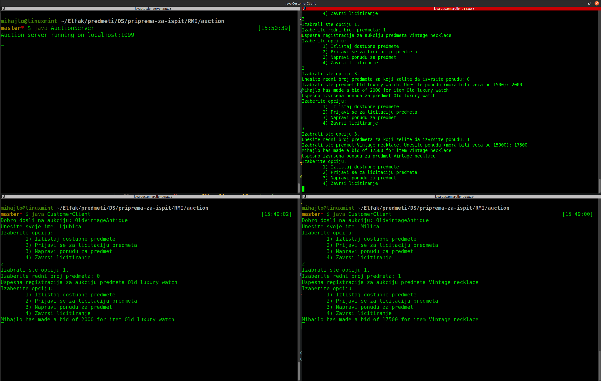

# Java RMI

Postavka - moj primer sa callback-om:

**Prosti aukcioni sistem**.

- Kupac (klijent) moze da izlista sve proizvode za koje je moguce dati ponudu.
- Kupac moze da se prijavi da ucestvuje na aukciji za neki proizvod, odnosno ovo mora da uradi ukoliko zeli da licitira za njega.
- Kupac moze da izvrsi licitaciju ukoliko je prijavljen - u ovom trenutku se svim kupcima koji su se prijavili za licitiranje za dati proizvod salje poruka o novoj ceni.
- Za svaki proizvod se moze izvrsiti `N` licitacija. Nakon toga, proizvod se prodaje kupcu koji je ponudio najvise. Samo ovaj kupac se obavestava o tome, kao i ceni za koju je kupio proizvod.

> Napomena - obrada izuzetaka nije bas najbolja i kod je generalno pisan malo ad-hoc. Zbog toga ostavljam i jedan primer sa lab vezbi sa nadogradnjom callback-a.

---

Sta je bitno da se zna za Java RMI:

[Povratak na pocetnu stranicu](../README.md)